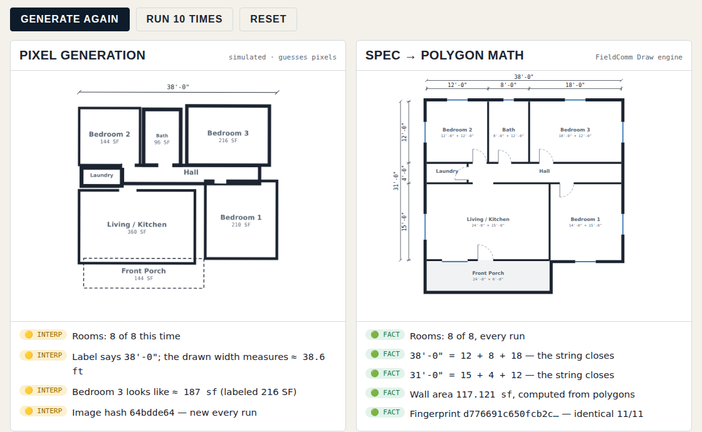
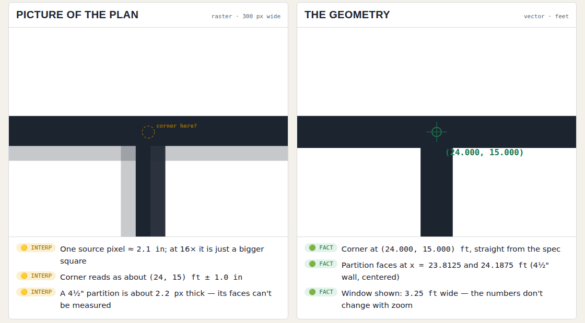
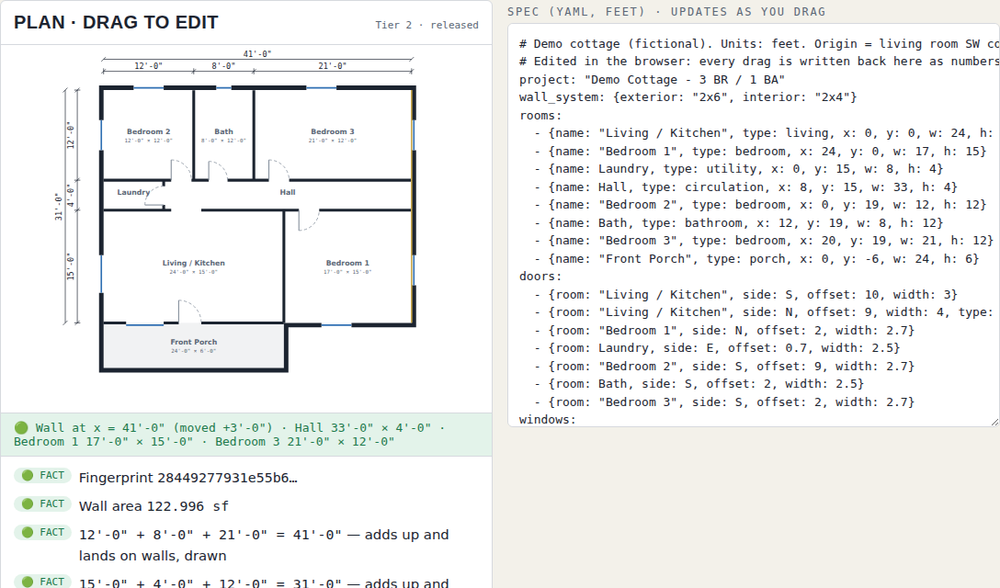
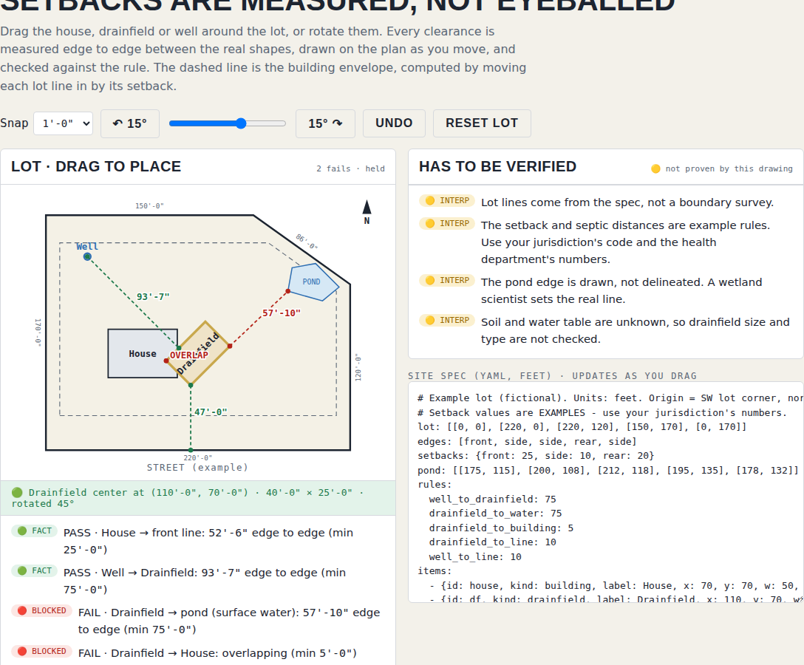

# FieldComm Draw

**Same spec. Same drawing. Every time.**

Image generators *guess pixels*. Ask one for a floor plan twice and the walls
wander, a bathroom disappears, and the "38'-0"" label stays put while the drawing
under it shrinks or stretches. That's fine for a mood board. It's useless for
anything you build from.

FieldComm Draw takes the opposite approach: **the dimensions are the truth and
the drawing is computed from them.** A plan is a short text spec in feet. A
deterministic engine checks it against code minimums, solves the walls as polygon
math, and fingerprints the result. Same spec in, identical geometry out.

### ▶ [Try the live demo](https://wswaldmann-lgtm.github.io/fieldcomm-draw-public/)

No install and no sign-up. It runs in your browser on a phone or a desktop.

| Repeatability | Scale |
|---|---|
|  |  |

**Drag and drop, without the drift.** Drag any wall, room, door or window.
Every move snaps to real feet and inches and is written back into the spec as
numbers, then the walls, dimension strings, code check and fingerprint are
recomputed. Walls that share a line move together, like a real wall, and
dimension strings follow the walls they measure. Rotate a room 90° with its ⟳
handle (or R): its doors and windows move with their walls, and overlapping
rooms are flagged 🔴.

**Site plans: setbacks are measured, not eyeballed.** Drag or rotate a house,
drainfield and well on an example lot (rotate any of them with the gold ⟳
handle, 5° steps or 1° with Shift), then add construction logistics
(crew parking, delivery truck, staging, dumpster, porta-john) to scale and keep
them off the red no-drive zones. Every clearance is measured edge to edge
between the real shapes and drawn live, and the building envelope is computed by
moving each lot line in by its setback. A 🟡 line shows how much a center-to-center
reading would overstate the clearance, and a "has to be verified" box lists what
the drawing can't prove. The check downloads as a report.

**Import your own PDF or photo.** On the site plan, import a survey, plat or plan
as a faded underlay (PDF, PNG or JPG). Pick the sheet scale printed on it
(1″ = 30′, 1/4″ = 1′-0″, …) or calibrate by clicking both ends of a known
dimension, then line it up with **Align 2 points** (click a point on the
underlay, then where it belongs on the plan, twice; plan picks snap to corners;
optionally set the scale from the pair) or move and rotate it by hand, and
measure on it. Everything read
off the underlay is marked 🟡 with its ± until you type it into the spec. A
fictional [sample boundary sketch](docs/samples/sample-boundary-sketch.pdf)
(1″ = 30′, drawn rotated 8°) is included to try it; `tools/make_sample_pdf.py`
rebuilds it. PDFs are read in your browser with Mozilla's
[pdf.js](https://mozilla.github.io/pdf.js/) (Apache-2.0); nothing is uploaded.

**Production planner.** [`planner.html`](https://wswaldmann-lgtm.github.io/fieldcomm-draw-public/planner.html)
is a drag-and-drop two-week look-ahead for construction crews. Drag activities
onto crew-days; crew-hours are checked against capacity, trade and sequence
live; rain/inspection days zero a crew out; and each activity's planned rate
stays a 🟡 estimate until the crew's actual output measures it 🟢. Prints as a
landscape look-ahead and exports CSV.

## Fact vs. interpretation

Every number the demo shows is marked:

- 🟢 **FACT**: computed from the geometry; anyone can reproduce it.
- 🟡 **INTERPRETATION**: read off pixels; an estimate, not proven.
- 🔴 **BLOCKED**: fails a check; the engine refuses rather than draws a wrong number.

A dimension string that doesn't add up, or doesn't land on a real wall, is
refused. A bedroom without an egress window holds the plan at Tier 2.

## The full engine

This repository is the free public demo and the [spec format](SPEC.md). The full
FieldComm Draw engine is in private development:

- Layered DXF sheets for CAD (opens in free QCAD or AutoCAD)
- Fixture symbols, title blocks and sheet sets
- Site plans with setbacks, buildings and parking
- AI drafting skills: an assistant writes the spec, and the engine draws and gates it

**[Sponsor the project](https://github.com/sponsors/wswaldmann-lgtm)** to keep it
moving and get early access. Questions and ideas are welcome in
[Issues](https://github.com/wswaldmann-lgtm/fieldcomm-draw-public/issues).

## What's here

| Path | What it is |
|---|---|
| `docs/` | The live demo (published to GitHub Pages) |
| `docs/samples/` | Sample PDF for the import tool (fictional) |
| `SPEC.md` | The spec format and room minimums (CC BY 4.0) |
| `examples/spec/` | Example specs (CC BY 4.0) |
| `examples/img/` | The same examples rendered by the full engine |
| `tests/` | Engine checks: determinism, wall areas against the full engine, gate, dimension strings |

## Not for construction

FieldComm Draw produces schematic and concept drawings. Plans for permit must be
prepared or reviewed and sealed by a licensed architect or engineer as your
jurisdiction requires. Code minimums are planning baselines, not a substitute for
review by your building department.

## License

© 2026 FieldComm Consulting LLC. All rights reserved: you may use and share the
demo and read the code, but not copy or reuse it. The spec format and examples are
CC BY 4.0. See [LICENSE](LICENSE).
